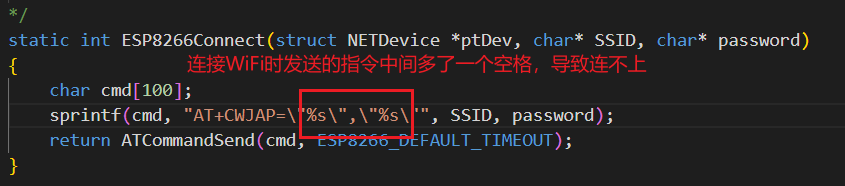

---

---

# SmartDeviceControl_FreeRTOS_Hal_Zet6

## 系统框图

## 显示子设备

### 框图

- 我们不想让文件互相调用

### 遇到的问题：OLED 无响应，I2C无法工作

解决：使用的是软件I2C，问题在于OLED的驱动中已经包含获取从机应答的函数

## 输入子系统

- 网络输入 可作为一个输入设备，将输入的信息放到环形缓冲区

  - 网络输入出现的问题：传输几次，才收到一次。

    - 原因：

    

    - 解决：

    

    

## 网络子系统

### 框图

- 连接网卡设备可以使用不同的接口，预留出接口可扩展

### 网络设置

### 遇到的问题

### ESP-01S

### 相关知识

#### 路由器和AP

路由器（Router）

- **功能**：路由器的主要功能是连接多个逻辑上分开的网络，并根据信道的情况自动选择和设定路由，以最佳路径，按前后顺序发送信号。路由器通常用于家庭或企业网络中，将内部网络与外部网络（如互联网）连接起来。
- **用途**：路由器通常用于网络之间的数据传输，它可以连接有线和无线设备，并提供网络地址转换（NAT）、防火墙保护、动态主机配置协议（DHCP）等功能。

接入点（AP，Access Point）

- **功能**：接入点主要用于创建无线网络，允许无线设备连接到有线网络。AP本身不执行路由功能，它只是**作为无线设备和有线网络之间的桥梁**。
- **用途**：AP通常用于扩展网络的覆盖范围，通过在不同的物理位置部署多个AP，可以创建一个广泛的无线覆盖区域。AP常用于家庭、公共场所和企业环境中，提供无线网络连接。

区别

- **路由器**通常包含接入点的功能，可以提供无线连接，但它的主要功能是路由，即连接不同的网络并管理数据传输。
- **接入点**主要用于提供无线连接，它不执行路由功能，而是作为无线设备和有线网络之间的桥梁。

因此，虽然路由器可以提供接入点的功能，但接入点并不具备路由器的全部功能。在一些设备中，路由器和接入点可能集成在同一硬件中，但在功能上仍然可以区分开来。

## 业务子系统

- 遇到的问题：网络输入事件无法控制设备

  - 原因：

    - 

      

## FreeRTOS

- 队列：输入队列
  - 谁放队列：
    - 1. 按键输入事件：在中断处理函数中，将事件放入队列
      2. 网络输入解析并上报为事件
  - 谁读队列：
    - 1. App综合控制函数，读取队列并控制

### 出现的错误

- 在中断中调用FreeRTOS的代码时，中断的优先级 大于 RTOS允许的最高优先级
  - 

- 消息队列传输的本质
  - 
  - 实质上是数据之间的复制

## GPIO

